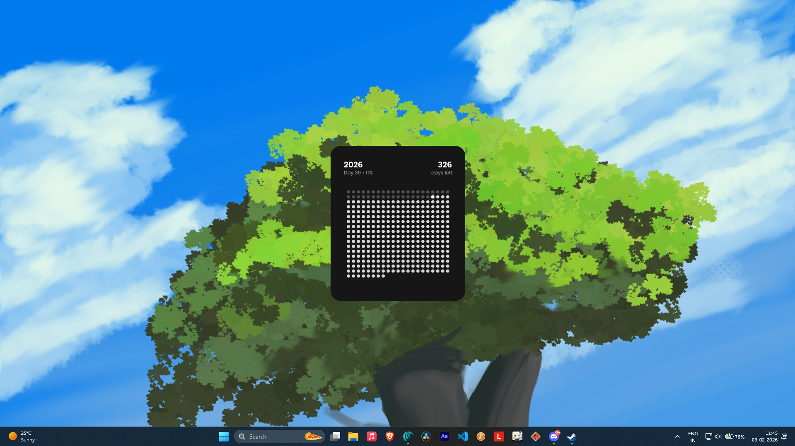

<h1 align="center">
  <span>White Zone</span>
</h1>

<p align="center">
    
</p>

Widget made for Windows & Linux using Rust heavily inspired by 'Dale: Days Left & Years Tracker' available on iOS. 

The widget has very simple way of telling you how many days you have wasted and how many you have left to waste (not accounting your death or end of world) to make your life more productive (like that ever gonna happen).

## Installation
Windows:

Download the .exe from [latest release](https://github.com/Firefly-SL/white-zone/releases/latest)
After downloading, you can put the .exe in the Startup folder to autostart it.

> Press Win+R and type shell:startup to get into startup folder

Linux:

Run this in terminal
```bash
curl -fsSL https://raw.githubusercontent.com/Firefly-SL/WhiteZone/refs/heads/main/install.sh | bash
```

> `Ctrl + Q`: To quit the widget.

## Uninstall
Windows:

Delete the .exe in the startup folder.

Linux:

Run this in terminal
```bash
curl -fsSL https://raw.githubusercontent.com/<username>/<repo>/<branch>/install.sh | bash -s -- --uninstall
```

## Build from source
To build and run white-zone, you will need to have Rust installed. If you don't have it, you can install it by following the instructions on the [official Rust website](https://www.rust-lang.org/tools/install).

> A wise man once said 'YouTube search would save lot of time'.

1.  **Clone the repository**:
    ```bash
    git clone https://github.com/Firefly-SL/WhiteZone.git
    cd white-zone
    ```
2.  **To build the widget**:
    ```bash
    cargo build --release
    ```
    The `--release` flag is recommended (not mandatory) for better optimized build.

### Configuration

white-zone's appearance can be customized by editing the `config.toml` file. This file is automatically created the first time you run the widget.

*   **Windows**: `%USERPROFILE%\Documents\white-zone\config.toml`
*   **Linux**: `~/.config/white-zone/config.toml`

The `config.toml` file allows you to adjust:

*   **Window settings**: `size`, `ability to resize`, `position`, `corner_radius`, `lock_in_center`, and `drop_shadow` properties.
*   **Theme colors**: `background` and `heading` colors for the widget.
*   **Dot grid**: `column_count`, `color_past`, `color_future`, `color_today`, and `color_today_glow`.

> `Shift + R`: To Relaunch the widget (after config changes).

You can turn off lock_in_center to freely move the widget were you desire.

NOTE: Now the funny part; resizing and moving the app will never be presistent across reboots (happening because of a clever trick i did). this lack of whatever will be fixed, maybe. if you want to resize and change position use the fields size and position to do it manually (manually). Reach me for help (put up a issue).

## Contributing

This project is on the early satges and i want to make it more useful for others. Even contributions like finding an optimal drop shadow settings is very much appreciated (i am no good at this).

## License

The source code for white-zone is licensed under the GPL 3.0 license. See the [LICENSE](LICENSE) file for more details.

The fonts included in this project (`Poppins-Regular.ttf` and `Poppins-SemiBold.ttf`) are licensed under the Open Font License (OFL). See [OFL](src/fonts/OFL.txt) for more details.